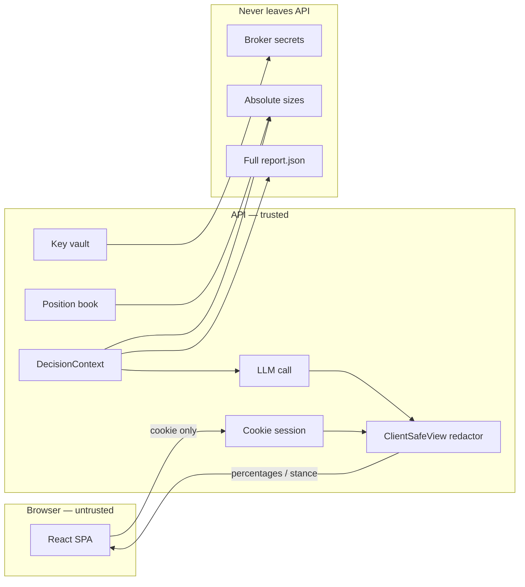

# Backend — Security-first Take Decision

**Version:** 0.3.0-draft · **Date:** 2026-07-24  
**Stack (proposed):** FastAPI + Postgres · React SPA (existing)  
**Priority:** Security and privacy over feature richness.

---

## 1. Goal

Add a backend that can:

1. Authenticate users with **HTTPOnly cookie sessions** (no JWT to the client).
2. Store **encrypted, read-only** broker API keys (Binance, Bitget, Bitunix, Hapi).
3. Build a private **DecisionContext** (reports + live market + user book) **only on the server**.
4. Run an AI **Take Decision** flow that advises using that context.
5. Expose to the browser **only redacted advice** — never absolute holdings.

The static dashboard (reports, charts, public market data) can remain as-is. Anything involving identity, keys, or positions goes through the API.

---

## 2. Non-negotiable security rules

### 2.1 Session auth — cookies, not JWT in the client

| Rule | Detail |
|------|--------|
| Mechanism | Opaque session ID in an **HTTPOnly**, **Secure**, **SameSite=Lax** (or `Strict` if same-site only) cookie |
| Storage | Session row in Postgres (or Redis): `session_id` hash, `user_id`, `expires_at`, `ip`/`ua` fingerprint optional |
| Client | Never receives a bearer token; never stores auth in `localStorage` / `sessionStorage` |
| CSRF | SameSite + CSRF token for state-changing POSTs (double-submit cookie or synchronizer token) |
| Logout | Delete server session + clear cookie |
| Rotation | Rotate session ID on login and on privilege changes (linking a broker) |

**Why not JWT to the client:** JWTs are often copied into JS storage, logged, or leaked via XSS. An opaque HTTPOnly cookie is not readable by page scripts; revocation is immediate by deleting the server row.

### 2.2 No absolute sizes to the client

The browser must **never** receive:

- BTC / USDT / coin **quantities**
- Fiat or stablecoin **balances**
- Stock / ETF **share counts** or **notional $**
- Entry size, margin used, liquidation distance in **absolute** terms
- Raw broker payloads or position lists with sizes

The browser **may** receive (examples):

| Allowed | Example |
|---------|---------|
| Direction / presence | `spot: long BTC`, `futures: short BTC-PERP` |
| Venue labels | `binance`, `bitget` (no account ids) |
| **Percentages / ratios** | `spot BTC ≈ 62% of crypto book`, `futures margin used ≈ 18% of futures equity` |
| Relative risk | `size: small \| medium \| large` (server-bucketed, not raw) |
| Alignment vs report | `above reduceIf`, `below addIf` (boolean / enum) |
| PnL **%** | `unrealizedPnlPct: -2.4` (not absolute PnL $) |
| AI prose | Text that uses % / stance only; server strips numbers that look like sizes |

**Enforcement:** a single **redaction layer** (`ClientSafeView`) sits between domain models and every JSON response / SSE stream. Unit tests fail if response schemas include `qty`, `amount`, `balance`, `notional`, etc.

### 2.3 Broker keys

- Read-only permissions only (no withdraw / trade).
- Envelope encryption at rest (DEK + KEK from env/KMS).
- Decrypt only in memory for sync / decision; never log plaintext.
- Never return key material (or truncated keys) to the client.
- Revoke = wipe ciphertext + stop sync.

### 2.4 Leak surface minimization

- Error messages: generic (`invalid credentials`, `sync failed`) — no “user X has N BTC”.
- Logs: no positions, balances, or keys; use internal request ids.
- AI prompts stay **server-side**; the client only gets the redacted decision object.
- Rate-limit auth, sync, and `/decisions/take`.
- Optional: hide whether an email is registered (same response for login miss).

---

## 3. Trust boundaries



**Absolute numbers exist only inside the API process** (and encrypted DB for keys / optional encrypted position cache). The SPA never hydrates a “portfolio” with sizes.

---

## 4. Session design (HTTPOnly cookies)

### 4.1 Cookie

```
Set-Cookie: sid=<opaque>; HttpOnly; Secure; SameSite=Lax; Path=/; Max-Age=...
```

- `sid` is a high-entropy random value; DB stores **hash(sid)** only.
- Separate `__Host-csrf` or header CSRF for mutating requests.
- API and SPA on related sites: prefer same parent domain (`app.example.com` + `api.example.com`) with careful CORS (`credentials: include`, explicit origin allowlist).

### 4.2 Endpoints (auth)

| Method | Path | Notes |
|--------|------|--------|
| `POST` | `/auth/login` | Sets `sid` cookie; body never echoes session id |
| `POST` | `/auth/logout` | Clears cookie + deletes session |
| `GET`  | `/auth/me` | `{ id, email?, displayName? }` — **no** portfolio |
| `GET`  | `/auth/csrf` | Issue CSRF token if needed |

No `Authorization: Bearer` for browser clients.

---

## 5. Client-safe API contracts

### 5.1 Positions (redacted)

```json
{
  "asOf": "2026-07-24T18:00:00Z",
  "venues": ["binance", "bitget"],
  "spot": {
    "assets": [
      { "symbol": "BTC", "side": "long", "weightPctOfSpot": 72.5, "weightPctOfTotal": 55.0 }
    ]
  },
  "futures": {
    "positions": [
      {
        "symbol": "BTCUSDT",
        "side": "short",
        "weightPctOfFuturesNotional": 100,
        "unrealizedPnlPct": -1.2,
        "vsReport": "below_reduce_if"
      }
    ],
    "marginUsedPct": 22.0
  }
}
```

No `qty`, `entryPrice` optional? **Entry price** can leak size context with mark — prefer omit, or allow mark/entry only as **distance %** from live/report levels.

### 5.2 Take Decision response (redacted)

```json
{
  "id": "dec_...",
  "createdAt": "...",
  "stance": "REDUCE",
  "spot": {
    "action": "trim",
    "rationale": "Price lost the report floor; spot is ~55% of total book — scale risk, not size disclosed.",
    "suggestedChangePctOfSpot": -15
  },
  "futures": {
    "action": "hold_or_reduce",
    "rationale": "Short already aligned with bearish midday bias; margin ~22% used.",
    "suggestedChangePctOfFutures": 0
  },
  "alignedWithReport": true,
  "risks": ["Oil / yields still risk-off"],
  "confidence": 0.62,
  "disclaimer": "Educational only. Not an order."
}
```

Post-process LLM output with a **number scrubber**: strip patterns that look like coin amounts / large USD notionals before respond + before persist-to-client.

### 5.3 What the AI sees (server only)

Full `DecisionContext` **may** include absolute sizes for better advice. That blob:

- Is never serialized to the client
- Is not stored in plaintext logs
- Optional: store encrypted decision audit; client history uses redacted copy only

---

## 6. Redaction implementation checklist

1. Domain models: `PositionRaw` (internal) vs `PositionPublic` (API schema).
2. FastAPI response models: only `*Public` types on routes.
3. `build_decision_context(user) -> DecisionContext` (internal).
4. `to_client_decision(raw_llm) -> DecisionPublic` (scrub + validate).
5. Tests: fixtures with huge balances → assert response JSON has no absolute fields; snapshot regex rejects `\d+\.\d+\s*BTC`, `$[0-9]{4,}`, etc.
6. Frontend: never add UI fields for “Balance” / “Qty”; only % bars and stance chips.

---

## 7. Phased delivery (security-ordered)

| Phase | Deliverable |
|-------|-------------|
| **0** | FastAPI + Postgres + HTTPOnly sessions + CSRF + `/auth/me` (no portfolio) |
| **1** | Encrypted broker vault + Binance read-only sync; **raw book server-only** |
| **2** | `GET /v1/portfolio/summary` — **percentages only** + ClientSafeView tests |
| **3** | Context assembler + LLM Take Decision; redacted response + scrubber |
| **4** | React: login (cookie), broker link UI, Take Decision box (no size displays) |
| **5** | Bitget / Bitunix / Hapi adapters; hardening, rate limits, audit |

---

## 8. Stack reminder

- **API:** Python FastAPI (LLM + report JSON ergonomics).
- **Sessions:** server-side opaque cookies (not JWT).
- **DB:** Postgres.
- **FE:** existing React app; `credentials: "include"` on API fetches.

---

## 9. Open decisions (still needed)

1. Single-user invite-only vs public signup.
2. LLM provider.
3. Hosting (API must be HTTPS for Secure cookies).
4. Exact Hapi API identity for the adapter.

---

## 10. Summary

**Security is the product feature:** HTTPOnly cookie sessions, encrypted read-only keys, and a hard rule that **absolute position sizes never cross the browser boundary**. The AI may reason on full numbers server-side; the Take Decision box only shows stances, percentages, and qualitative guidance.
